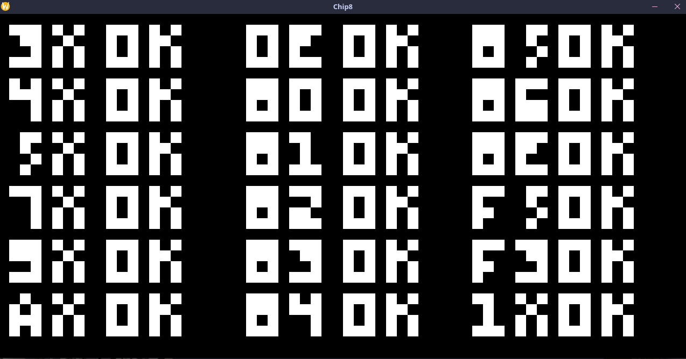

# Chip8 Emulator

Chip8 emulator using SDL3

You can get some ROMs from [here](https://github.com/kripod/chip8-roms)

Screenshot using [this](https://github.com/corax89/chip8-test-rom) test rom


## Usage

./main <rom>

The keyboard is as such: \
1 2 3 4 \
Q W E R \
A S D F \
Z X C V 

## Requirements

- SDL3

## Build
Makefile only supports linux

```bash
make

